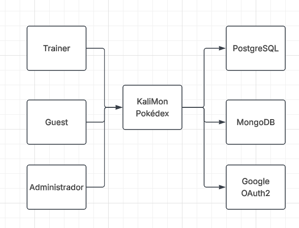
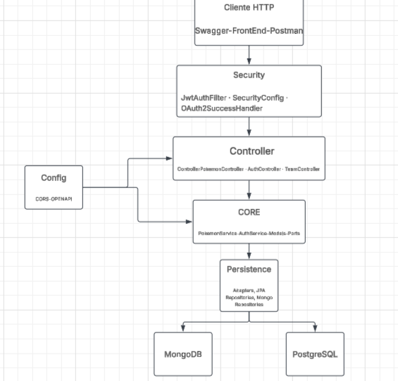
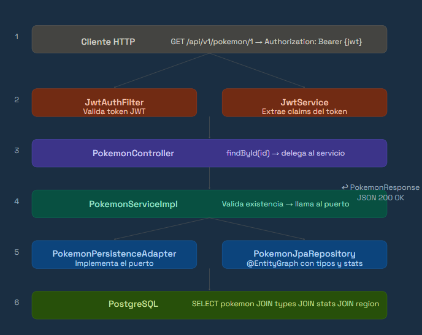
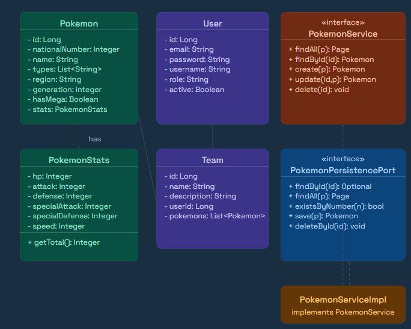
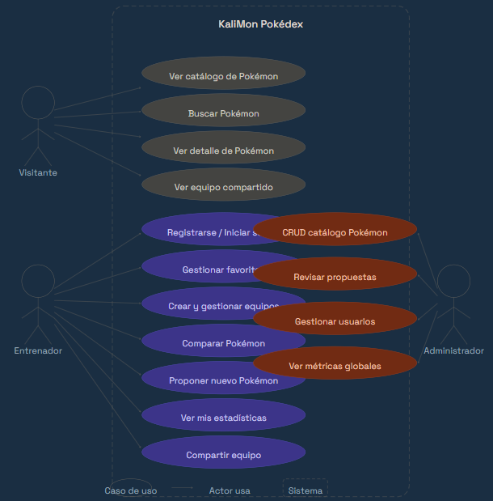
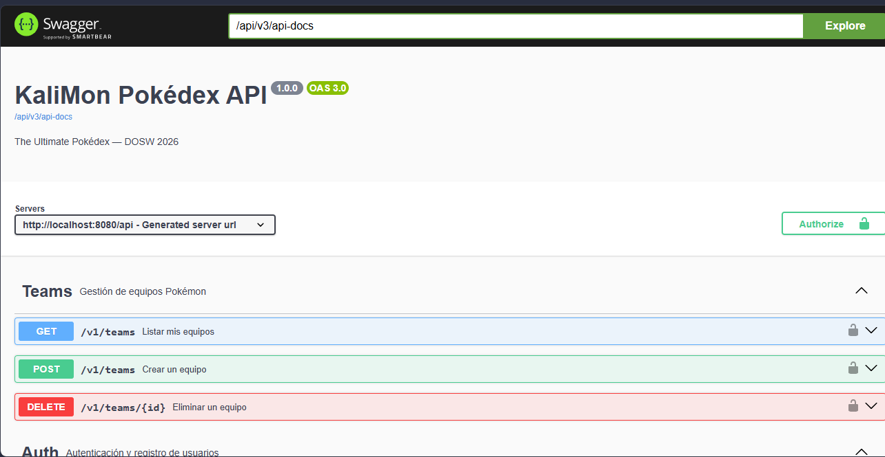
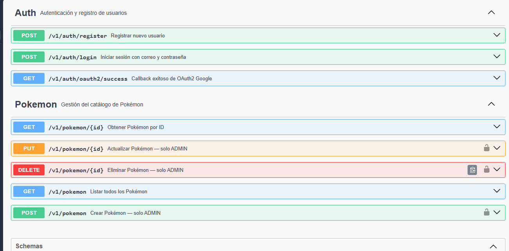
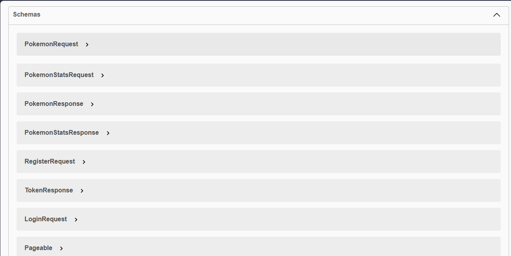

# KaliMon — The Ultimate Pokédex

> **DOSW · 2026 Intersemestral** — Kaliche (Carlos Rojas)  
> API REST desarrollada con Java 21 y Spring Boot 3.3, arquitectura por capas, autenticación JWT + OAuth2 Google, persistencia dual PostgreSQL + MongoDB y documentación Swagger.

---

## 📎 Enlaces del proyecto

| Recurso | Enlace                                                                               |
|---------|--------------------------------------------------------------------------------------|
| 📌 Tablero Jira | [Ver tablero de Jira](#)                                                             |
| 🎨 Prototipo Figma | [Ver prototipo hecho en Figma](https://www.figma.com/make/RY5OGlluQoZItpamPVsZ2L/Ayuda-para-dise%C3%B1o?p=f&t=PVqs5YpwqrnxdxUJ-0)                                                     |
| 📄 Análisis de Requerimientos | [Ver análisis de requerimientos](KaliMon_Requerimientos_DOSW.docx)                                                   |
| 🖼️ Manual de Identidad KaliMon | [Ver manual de identidad](#)                                                         |
| 📊 Swagger UI (local) | [http://localhost:8080/api/swagger-ui.html](http://localhost:8080/api/swagger-ui.html) |

---

## 📖 ¿Qué es KaliMon?

KaliMon es una Pokédex web completa que permite a los entrenadores explorar, buscar y gestionar información de Pokémon. El proyecto incluye:

- Catálogo completo de Pokémon con búsqueda, filtros avanzados y paginación
- Sistema de autenticación con correo/contraseña y login social con Google (OAuth2)
- Gestión de equipos competitivos con análisis de debilidades y resistencias de tipo
- Sistema de favoritos persistente por usuario
- Flujo de propuesta y aprobación de nuevos Pokémon por parte de la comunidad
- Dashboard de estadísticas personales y globales (admin)
- Comparador de Pokémon lado a lado
- Panel de administración para gestión de catálogo y usuarios

---

## ✅ Funcionalidades implementadas

### 🔐 Autenticación y perfiles

| RF | Descripción |
|----|-------------|
| RF-01 | Registro con correo y contraseña |
| RF-02 | Verificación de correo electrónico |
| RF-03 | Inicio de sesión con Gmail (OAuth 2.0) |
| RF-04 | Recuperación de contraseña |
| RF-05 | Gestión del perfil de usuario |

### 📖 Catálogo de Pokémon

| RF | Descripción |
|----|-------------|
| RF-06 | CRUD de Pokémon (solo admin) |
| RF-07 | Envío de propuesta de nuevo Pokémon |
| RF-08 | Revisión y aprobación de propuestas (admin) |
| RF-09 | Listado paginado de Pokémon |
| RF-10 | Detalle completo de un Pokémon |
| RF-11 | Búsqueda por nombre o número (debounce 300ms) |
| RF-12 | Filtros avanzados combinados con lógica AND |

### ⚔️ Equipos y funcionalidad competitiva

| RF | Descripción |
|----|-------------|
| RF-13 | Creación y gestión de equipos (máx. 6 Pokémon) |
| RF-14 | Análisis competitivo de tipos del equipo |
| RF-15 | Compartir equipo con enlace público |
| RF-16 | Guardar Pokémon favoritos |

### 📊 Estadísticas y métricas

| RF | Descripción |
|----|-------------|
| RF-17 | Métricas personales de uso |
| RF-18 | Dashboard global de métricas (admin) |
| RF-19 | Historial de actividad del usuario |
| RF-20 | Comparador de Pokémon lado a lado |

---

## 🛠️ Stack tecnológico

### Backend
| Tecnología | Versión | Uso |
|-----------|---------|-----|
| Java | 21 LTS | Lenguaje principal |
| Spring Boot | 3.3.5 | Framework principal |
| Spring Security | 6.x | Autenticación y autorización |
| Spring Data JPA | 3.x | ORM y repositorios relacionales |
| Spring Data MongoDB | 4.x | Repositorios de documentos |
| MapStruct | 1.6.2 | Mapeo entre capas |
| Lombok | 1.18.30 | Reducción de boilerplate |
| JJWT | 0.11.5 | Generación y validación de JWT |
| SpringDoc OpenAPI | 2.3.0 | Documentación Swagger |

### Bases de datos
| Tecnología | Uso |
|-----------|-----|
| PostgreSQL 15 | Datos relacionales: Pokémon, usuarios, equipos, tipos, regiones |
| MongoDB 7 | Estadísticas de uso, métricas, historial de actividad |

### Infraestructura
| Tecnología | Uso |
|-----------|-----|
| Docker + Docker Compose | Contenedores de bases de datos en desarrollo |
| Maven | Gestión de dependencias y build |

### Herramientas de calidad
| Herramienta | Uso |
|------------|-----|
| JUnit 5 | Pruebas unitarias |
| Mockito | Mocking en pruebas |
| JaCoCo | Cobertura de código |
| AssertJ | Aserciones fluidas en pruebas |

---

## 🏗️ Arquitectura

KaliMon implementa una **arquitectura hexagonal por capas** que garantiza la separación de responsabilidades y la independencia de la lógica de negocio respecto a los detalles de infraestructura.

```
┌─────────────────────────────────────────────────────┐
│                   CLIENTE HTTP                       │
│           Swagger UI · Frontend · Postman            │
└─────────────────────┬───────────────────────────────┘
                      │
┌─────────────────────▼───────────────────────────────┐
│                    SECURITY                          │
│     JwtAuthFilter · SecurityConfig · OAuth2Handler   │
└─────────────────────┬───────────────────────────────┘
                      │
┌─────────────────────▼───────────────────────────────┐
│                  CONTROLLER                          │
│    PokemonController · AuthController · TeamCtrl     │
│    DTOs (request/response) · MapStruct mappers       │
│    GlobalExceptionHandler                            │
└─────────────────────┬───────────────────────────────┘
                      │
┌─────────────────────▼───────────────────────────────┐
│                     CORE                             │
│    PokemonServiceImpl · AuthServiceImpl              │
│    Modelos de dominio · Interfaces de puerto         │
│    Excepciones de negocio                            │
└─────────────────────┬───────────────────────────────┘
                      │
┌─────────────────────▼───────────────────────────────┐
│                 PERSISTENCE                          │
│    Adapters · JPA Repositories · Mongo Repositories  │
│    Entidades JPA · Documentos MongoDB                │
│    MapStruct persistence mappers                     │
└──────────┬──────────────────────┬───────────────────┘
           │                      │
    ┌──────▼──────┐      ┌────────▼────────┐
    │ PostgreSQL  │      │    MongoDB       │
    │  Pokémon   │      │  Estadísticas    │
    │  Usuarios  │      │  Métricas        │
    │  Equipos   │      │  Historial       │
    └────────────┘      └─────────────────┘
```

### Estructura de paquetes

```
src/main/java/com/kalimon/pokedex/
│
├── config/                     
│   ├── AppConfig.java
│   └── CorsConfig.java
│
├── security/                   
│   ├── JwtService.java
│   ├── JwtAuthFilter.java
│   ├── SecurityConfig.java
│   ├── OAuth2SuccessHandler.java
│   └── UserDetailsServiceImpl.java
│
├── controller/                 
│   ├── api/                  
│   │   ├── PokemonApi.java
│   │   ├── AuthApi.java
│   │   └── TeamApi.java
│   ├── impl/                   
│   │   ├── PokemonController.java
│   │   ├── AuthController.java
│   │   └── TeamController.java
│   ├── dto/
│   │   ├── request/            
│   │   └── response/           
│   ├── mapper/                 
│   └── handler/
│       └── GlobalExceptionHandler.java
│
├── core/                       
│   ├── model/                  
│   ├── port/                   
│   ├── service/
│   │   ├── interfaces/         
│   │   └── impl/               
│   └── exception/              
│
└── persistence/                
    ├── entity/
    │   ├── relational/         
    │   └── document/           
    ├── repository/
    │   ├── relational/         
    │   └── document/           
    ├── mapper/                 
    └── adapter/                
```

---

## 🔐 Seguridad

La API implementa dos flujos de autenticación:

**JWT (correo y contraseña)**
1. El usuario se registra con `POST /api/v1/auth/register`
2. Inicia sesión con `POST /api/v1/auth/login` y recibe un JWT
3. Incluye el token en cada petición: `Authorization: Bearer {token}`
4. El `JwtAuthFilter` valida el token en cada request antes de llegar al controller

**OAuth2 Google**
1. El usuario accede a `/oauth2/authorization/google`
2. Google redirige con el token al `OAuth2SuccessHandler`
3. El handler crea o vincula el perfil y genera un JWT propio
4. El token se devuelve en la URL de redirección

**Roles**
| Rol | Permisos |
|-----|----------|
| `TRAINER` | Leer catálogo, gestionar favoritos, equipos y propuestas personales |
| `ADMIN` | Todo lo anterior + CRUD catálogo, revisar propuestas, gestionar usuarios |

---

## 🗄️ Modelo de datos

**PostgreSQL — tablas principales**
```
users          → id, email, password, username, role, active, created_at
pokemon        → id, national_number, name, description, image_url, generation, has_mega
pokemon_stats  → id, pokemon_id, hp, attack, defense, special_attack, special_defense, speed
types          → id, name
regions        → id, name
pokemon_type   → pokemon_id, type_id  (relación M:N)
```

**MongoDB — colecciones**
```
pokemon_views  → pokemon_id, pokemon_name, view_count, last_viewed
```


### Pruebas implementadas

| Clase de prueba | Métodos | Cobertura |
|----------------|---------|-----------|
| `PokemonServiceImplTest` | 8 tests | Core service completo |
| `AuthServiceImplTest` | 4 tests | Registro y login |
| `GlobalExceptionHandlerTest` | 6 tests | Todos los handlers |
| `PokemonStatsTest` | 3 tests | Modelo y cálculo de total |
| `PokemonTest` | 3 tests | Builder y equals |
| `UserTest` | 3 tests | Builder y toBuilder |
| `TeamTest` | 2 tests | Builder y composición |
| `ExceptionTest` | 3 tests | Mensajes y códigos |

---

## 📡 Endpoints principales

### Auth (público)
```
POST /api/v1/auth/register    → Registrar usuario
POST /api/v1/auth/login       → Iniciar sesión → retorna JWT
GET  /api/v1/auth/oauth2/success → Callback OAuth2 Google
```

### Pokémon (GET público, escritura solo ADMIN)
```
GET    /api/v1/pokemon              → Listado paginado
GET    /api/v1/pokemon/{id}         → Detalle completo
POST   /api/v1/pokemon              → Crear Pokémon [ADMIN]
PUT    /api/v1/pokemon/{id}         → Actualizar Pokémon [ADMIN]
DELETE /api/v1/pokemon/{id}         → Eliminar Pokémon [ADMIN]
```

### Teams (requiere autenticación)
```
GET    /api/v1/teams                → Mis equipos
POST   /api/v1/teams                → Crear equipo
DELETE /api/v1/teams/{id}           → Eliminar equipo
```

---

## 📋 Requerimientos no funcionales

| Código | Categoría | Criterio |
|--------|-----------|---------|
| RNF-01 | Rendimiento | Listado carga en < 2 segundos |
| RNF-02 | Usabilidad | Consulta en ≤ 3 clics |
| RNF-03 | Compatibilidad | Chrome, Firefox, Safari, Edge |
| RNF-04 | Seguridad | Contraseñas bcrypt + JWT + rutas protegidas |
| RNF-05 | Accesibilidad | WCAG 2.1 nivel AA |
| RNF-06 | Mantenibilidad | Arquitectura por capas documentada |
| RNF-07 | Disponibilidad | Uptime ≥ 99% |
| RNF-08 | Escalabilidad | ≥ 100 usuarios concurrentes |
| RNF-09 | Responsividad | Pantallas ≥ 360px |
| RNF-10 | Protección de datos | Sin PII expuesta en API ni logs |

---
## Diagramas

### Diagrama c4


### Diagrama de Componentes General


### Diagrama de Componentes especifico


### Diagrama de clases


### Diagrama Casos de Uso

--
## Swagger





## 👤 Autor

**Carlos Rojas — Kaliche**  
Desarrollo y Operaciones de Software · 2026 Intersemestral  
Escuela Colombiana de Ingeniería Julio Garavito
